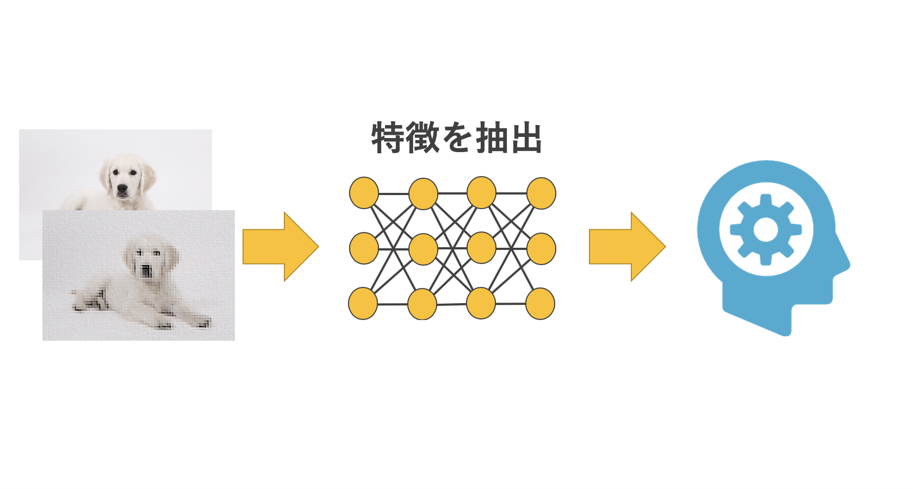

# 画像認識 AI に触れてみよう

## 目次

- [AI による画像識別・物体検出の仕組み](#AI-による画像識別・検出の仕組み)
- [画像識別を実行してみよう](#画像識別を実行してみよう)
- [物体検出を実行してみよう](#物体検出を実行してみよう)
- [検出した部分に画像処理をしてみよう](#検出した部分に画像処理をしてみよう)

## AI による画像識別・物体検出の仕組み

### AI が物体を認識出来るようになるまで

    犬を学習する例

- 人間の場合

1. いろんな種類の犬を見る

   

2. 特徴を見つけて、犬はどんな見た目をしているか記憶する

   - 耳が２つある・・・
   - 足が４本ある・・・
   - 毛が生えている・・・

   

3. 記憶した特徴をもとに認識

   

- AI の場合

1. 大量の画像を読み込ませる

   

2. 画像から特徴を抽出する

   従来の方法では人間が特徴を指定していた

   

   現在では AI が自ら特徴を見つけることが出来る

   - 何色である・・・
   - どんな形である・・・

   → 画像としての特徴を見つける

   

3. 抽出した特徴をもとに認識

   

- ディープラーニングを用いると人間でも発見するのが難しい特徴も見つけることが出来る

  製品不良を見つける例

  - 人間の場合

    目視で確認するため、経験を積んでいないと不良品の特徴が分からない

    

  - ディープラーニングを用いると・・・

    不良品の特徴を自動で抽出

    

    

### 画像識別と物体検出の違いとは

- 画像識別はその画像が何を写しているかを言い当てる

  

- 物体検出は画像に写っている物体は何か、どこにあるかを言い当てる

  

  複数の物体を検知することも出来る

  

## 画像識別を実行してみよう

[GoogleColab notebook を参照][notebook]

## 物体検出を実行してみよう

[GoogleColab notebook を参照][notebook]

## 検出した部分に画像処理をしてみよう

[GoogleColab notebook を参照][notebook]

[notebook]: https://colab.research.google.com/drive/1l9Vk1aMaDl6QBhqVREe1EnuUXZdYBNUm?usp=sharing
